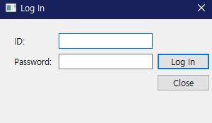
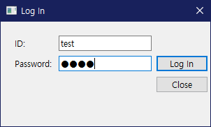
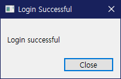
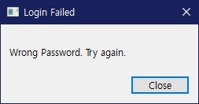
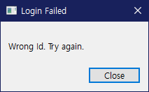
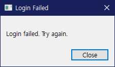

# Login 

## Login_example
One main window and dialog
User inputs the information on the dialog, the informations printed on the 
mainwindow widget with Python, Python Qt

> GUI would be like this- followed the code reference from: https://wikidocs.net/5249
> 
> Icon from: Iconfinder https://www.iconfinder.com/icons/9042739/pc_firewall_icon

1. Intro(login_intro.md)
2. login icon image(login_icon.png)
3. Login Dialog code
4. main
5. init module

- User login(ID/ Password)
  - if not right(wrong id or wrong password)>> try again
  - if right(id or password not wrong) login and available to using the system/software

- Functions will be added later:
  - password hide/show
  - Sign up
  - Finding my account(Finding ID/Password)

## Login_main

small window for log in. User enters id and password. By using setEchomode- password is hided

Right now I use right_id and right_password to see whether id, password or both values are wrong
but later I'm planning to add the method to check the data from connected database server

1. ui_login
2. ui_login_main
3. ui_main_login
4. images

- user login
  - checks value to meet the right_id and right_password
    - if not: LoginFailed
      1. wrong id
      2. wrong password
      3. wrong try(both wrong)
  - if the values right, LoginSuccessful
  - LoginFailed and LoginSuccessful window pops up after Log In button pushed >> Button action event
  
### LoginSuccessful

### LoginFailed
1. Wrong Password

2. Wrong Id

3. Both Values Wrong

- Function may be added later
  - Hiding password>> Password hide and show
  - merging LoginFailed and Successful into one method
  - closing main Log In dialog after LoginSuccess window closed
  - clear values of LineEdits in main Log In dialog after LoginFailed window closed
    - wrong id>> clear id line edit
    - wrong password>> clear password line edit
    - both line edits clear
  