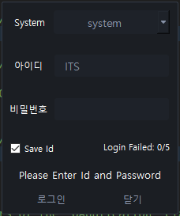

# Login 

## Login_example
One main window and dialog
User inputs the information on the dialog, the informations printed on the 
mainwindow widget with Python, Python Qt

> GUI would be like this- followed the code reference from: https://wikidocs.net/5249
> 
> Icon from: Iconfinder https://www.iconfinder.com/icons/9042739/pc_firewall_icon

1. Intro(login_intro.md)
2. login icon image(login_icon.png)
3. Login Dialog code
4. main
5. init module

- User login(ID/ Password)
  - if not right(wrong id or wrong password)>> try again
  - if right(id or password not wrong) login and available to using the system/software

- Functions will be added later:
  - password hide/show
  - Sign up
  - Finding my account(Finding ID/Password)

## Login_main
### Current Dialog

#### Connected to Database Successfully
related code is not included in this repository

#### Newly added
- Color Theme(Button, Line edit, etc.)
- fixed size by using setFixedSize
- Save id when Log in
  - using ini file *ini file not included in this repository*
- Replaced Login Message Dialog into Login Label to show message
  - Login Successful
  - Login Failed
- Counting log in try function
  - Maximum five times, log in Button disabled when log in failed five times
  - quit and restart the program
